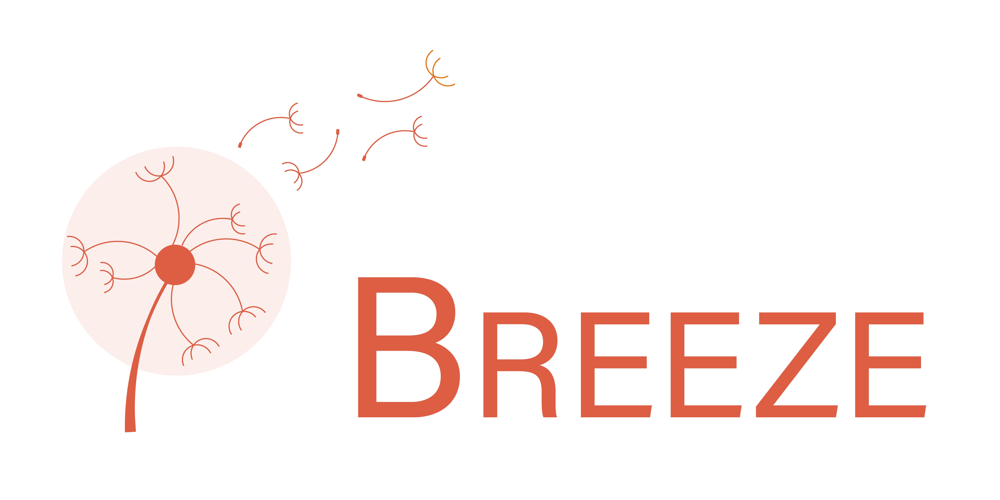

# BreezeLambdaAPIClient
  [](https://codecov.io/gh/swift-sprinter/BreezeLambdaAPIClient)

This is a client for the [Breeze Lambda API](https://github.com/swift-sprinter/Breeze) (from version 0.2.0).



## Installation

### Swift Package Manager

Add BreezeLambdaAPIClient as a dependency to the dependencies value of your `Package.swift`.

```swift
    dependencies: [
        //...
        .package(url: "https://github.com/swift-sprinter/BreezeLambdaAPIClient.git", from: "0.2.0"),
        // ...
    ]
)
```

## Usage

The following example shows how to use the client to create, read, update, delete and list items.
The `Item` is a struct that conforms to `Codable`.
The `Item` must be shared between the client and the [Breeze Lambda API](https://github.com/swift-sprinter/Breeze).

```swift
import Foundation
import BreezeLambdaAPIClient

protocol ItemServing {
    func create(item: Item) async throws -> Item
    func read(key: String) async throws -> Item
    func update(item: Item) async throws -> Item
    func delete(item: Item) async throws
    func list(startKey: String?, limit: Int?) async throws -> [Item]
}

struct ItemService: ItemServing {
    
    private let apiClient: BreezeLambdaAPIClient<Item>
    
    private let session: SessionService
    
    private var token: String? {
        session.userSession?.jwtToken
    }
    
    init(session: SessionService) {
        guard var env = try? APIEnvironment.dev() else {
            fatalError("Invalid Environment")
        }
        env.logger = Logger()
        self.session = session
        self.apiClient = BreezeLambdaAPIClient<Item>(env: env, path: "items", additionalHeaders: [:])
    }
    
    func create(item: Item) async throws -> Item {
        try await apiClient.create(token: token, item: item)
    }
    
    func read(key: String) async throws -> Item {
        try await apiClient.read(token: token, key: key)
    }
    
    func update(item: Item) async throws -> Item {
        try await apiClient.update(token: token, item: item)
    }
    
    func delete(item: Item) async throws {
        guard let updatedAt = item.updatedAt,
              let createdAt = item.createdAt else {
            throw ItemServiceError.invalidItem
        }
        try await apiClient.delete(token: token, key: item.key, createdAt: createdAt, updatedAt: updatedAt)
    }
    
    func list(startKey: String?, limit: Int?) async throws -> [Item] {
        try await apiClient.list(token: token, exclusiveStartKey: startKey, limit: limit)
    }
}

struct APIEnvironment {
    static func dev() throws -> APIClientEnv {
        try APIClientEnv(session: URLSession.shared, baseURL: "<API GATEWAY URL>", logger: nil)
    }
}

extension Item: KeyedCodable {}

struct Logger: APIClientLogging {
    func log(request: URLRequest) {
        print(request)
    }
    
    func log(data: Data, for response: URLResponse) {
        print(response)
        let value = String(data: data, encoding: .utf8) ?? ""
        print(value)
    }
}

enum ItemServiceError: Error {
    case invalidItem
}
```

Note:
The SessionService is used to get the JWT token. The session is not part of this package.

# Contributing

Contributions are more than welcome! Follow this [guide](https://github.com/swift-sprinter/BreezeLambdaAPIClient/blob/main/CONTRIBUTING.md) to contribute.